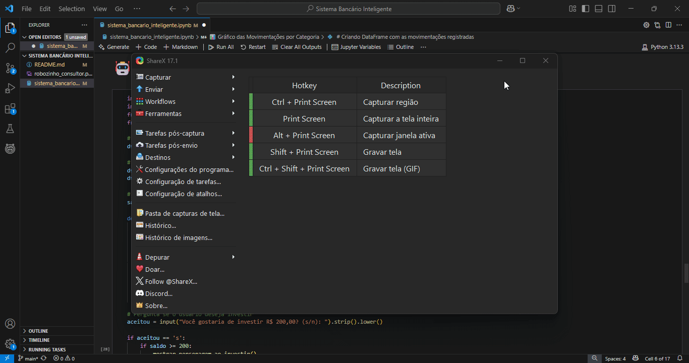

# 💰 Sistema Bancário com Robô Consultor Inteligente

Este projeto simula um **sistema bancário interativo** desenvolvido em **Python**, inspirado em um desafio da [DIO (Digital Innovation One)](https://www.dio.me/) no bootcamp de **Backend com Python do Santander**, que propõe a criação de um sistema simples de depósitos, saques e extrato bancário. A proposta original foi expandida com diversas melhorias voltadas à educação financeira, visualização de dados e interação assistida.


## 🚀 Melhorias implementadas e Funcionalidades

Além da proposta original do desafio, este projeto foi enriquecido com várias melhorias focadas em **educação financeira** e **inteligência de dados**, tendo como grande diferencial o **Robô Consultor Inteligente**.

| Funcionalidade                      | Descrição |
|------------------------------------|-----------|
| 🤖 **Robô Consultor Inteligente**  | Um assistente virtual que aparece na tela apenas quando o usuário aceita investir. Ele simula a aplicação e exibe uma imagem personalizada, tornando a experiência mais interativa e educativa. |
| 📊 **Gráficos Interativos e Animados** | Visualizações em pizza e barras, com animações temporais por mês e categoria, facilitando a análise de tendências e padrões de gastos. |
| 📅 **Histórico com Data e Categoria** | Cada movimentação (depósito, saque ou investimento) é registrada com data e categoria, permitindo um controle financeiro detalhado. |
| 🏷️ **Classificação Inteligente por Categoria** | O usuário pode classificar transações como alimentação, transporte, lazer, entre outras, o que auxilia no acompanhamento dos gastos. |
| 🧠 **Assistente Financeiro** | Oferece alertas sobre hábitos de consumo, sugestões de economia e simula potenciais ganhos com investimentos baseados no saldo atual. |
| 💡 **Sugestões de Investimento** | Caso o saldo ultrapasse determinado valor, o sistema sugere uma divisão inteligente entre Tesouro, Fundos e Ações. |
| 🚨 **Alertas de Gastos Mensais** | O sistema emite avisos automáticos quando os gastos ultrapassam um limite mensal predefinido. |
| ✅ **Depósitos, Saques e Extrato** | Funções básicas do sistema bancário com validações, limite de saques e extrato com saldo atualizado em tempo real. |


## 📌 Observações
- Sistema simulado para um único usuário.
- Movimentações armazenadas apenas em memória durante a execução.
- Foco educacional: decisões financeiras reais devem ser feitas com auxílio profissional.


## 🖼️ Demonstração visual

<p align="center">
  
  <br><em>Robô Consultor em ação durante simulação de investimento</em>
</p>


## 🖼️ Demonstração em GIF




## 🛠️ Tecnologias Utilizadas

- Python 3
- Jupyter Notebook
- Pandas
- NumPy
- Plotly

## ▶️ Como Usar

1. Clone este repositório:

```bash
git clone https://github.com/seuusuario/sistema-bancario-inteligente.git
```

2. Navegue até o diretório e abra o notebook:

```bash
cd sistema-bancario-inteligente
jupyter notebook sistema_bancario_com_ia.ipynb
```

3. Execute célula por célula para interagir com o sistema.


📂 Estrutura do Projeto

```bash
📁 sistema-bancario-inteligente/
├── sistema_bancario_inteligente.ipynb   # Notebook principal
├── robozinho_consultor.png # Imagem do assistente virtual
├── README.md # Documentação do projeto

```
## 📧 Contato

Desenvolvido por **Lidiane Souza**  
🔗 LinkedIn: linkedin.com/in/lidiane-souza88

