# 💰 Sistema Bancário com Robô Consultor Inteligente

Este projeto apresenta um **sistema bancário interativo** desenvolvido em **Python**, inspirado no desafio da [DIO (Digital Innovation One)](https://www.dio.me/) do bootcamp de **Backend com Python do Santander**. 

O objetivo é criar uma aplicação simples que permite aos usuários realizar operações bancárias essenciais, como **depósitos, saques e consulta de extrato**, de forma intuitiva e eficiente.  

Além da proposta inicial, este projeto foi ampliado com recursos avançados voltados para **educação financeira** e **inteligência de dados**, oferecendo uma experiência enriquecedora. O grande destaque é o **Robô Consultor Inteligente,** um assistente virtual que entra em cena quando o usuário decide investir. Ele sugere a aplicação e exibe uma imagem personalizada, tornando a experiência mais interativa e educativa. Complementam essa experiência gráficos interativos e categorização de transações, permitindo ao usuário uma melhor gestão e tomada de decisão financeira.  

---

## 🚀 Melhorias implementadas e Funcionalidades

> 🎬 **Dica:** Os GIFs e imagens abaixo são interativos — **clique em qualquer um para vê-lo em tamanho maior e com mais detalhes.**

| Funcionalidade                      | Descrição | 📄 Código Executado | 🎞️ Resultado |
|------------------------------------|-----------|----------------------|--------------|
| 🤖 **Robô Consultor Inteligente**      | Um assistente virtual que aparece na tela apenas quando o usuário aceita investir. Ele sugere a aplicação e exibe uma imagem personalizada, tornando a experiência mais interativa e educativa. | [Robô Consultor](py/robo_consultor.py) | <a href="imagens/robozinho_em_acao.gif">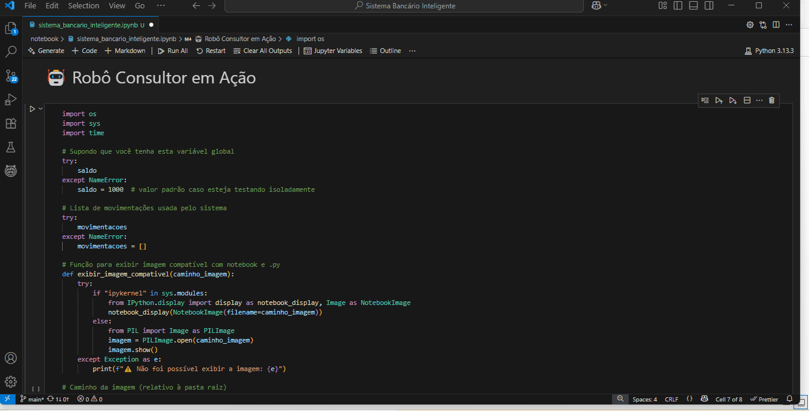</a> |
| 📊 **Gráficos Interativos e Animados** | Gráficos de pizza e barras com animações temporais por mês e categoria, facilitando a análise de tendências e padrões de gastos. | [Transações - Opção [m]](py/transacoes_bancarias.py) | <a href="imagens/grafico_movimentacoes.gif">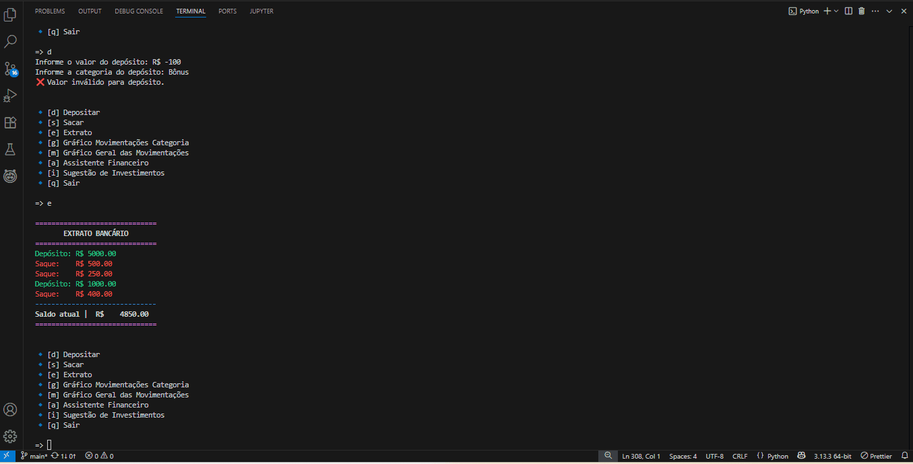</a> |
| 🏷️ **Classificação por Categoria**     | O usuário pode classificar transações como alimentação, transporte, lazer, entre outras, o que auxilia no acompanhamento dos gastos. | [Transações - Opção [g]](py/transacoes_bancarias.py) | <a href="imagens/grafico_categoria.gif">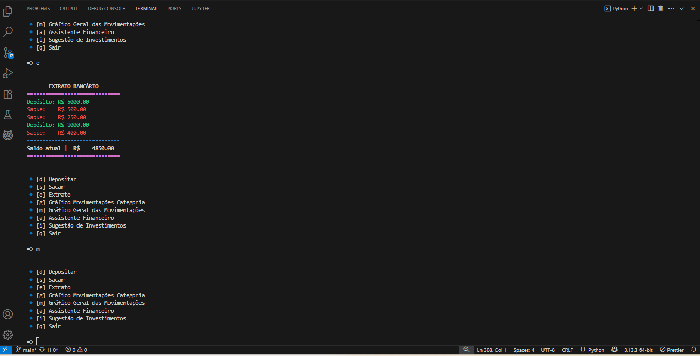</a> |
| 🧠 **Assistente Financeiro**           | Oferece alertas sobre hábitos de consumo, sugestões de economia e simula potenciais ganhos com investimentos baseados no saldo atual. | [Transações - Opção [a]](py/transacoes_bancarias.py) | <a href="imagens/assistente_financeiro.gif">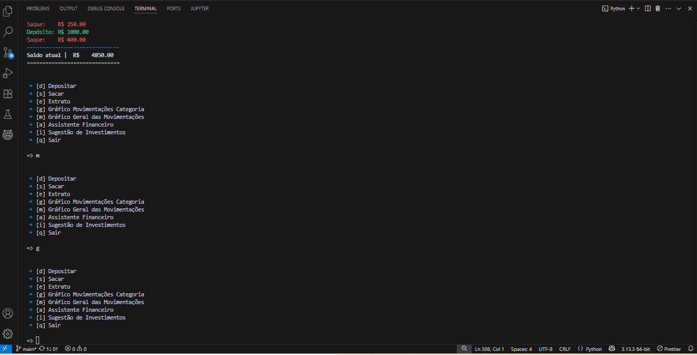</a> |
| 💡 **Sugestões de Investimento**      | Caso o saldo ultrapasse determinado valor, o sistema sugere uma divisão inteligente entre Tesouro, Fundos e Ações. | [Transações - Opção [i]](py/transacoes_bancarias.py) | <a href="imagens/sugestoes_investimentos.gif">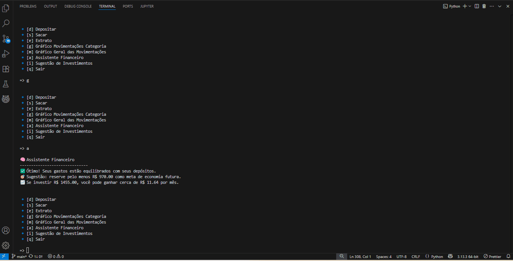</a> |
| 🚨 **Alertas Financeiros Inteligentes**| O sistema emite avisos automáticos quando os gastos ultrapassam um limite mensal predefinido. | [Alertas Inteligentes](py/alertas_inteligentes.py) | <a href="imagens/alertas_inteligentes.gif">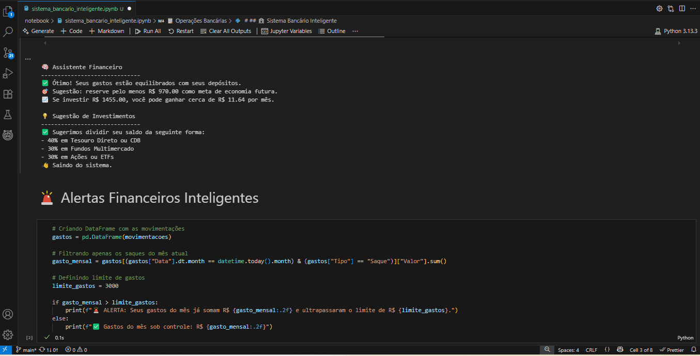</a> |
| ✅ **Depósitos, Saques e Extrato** | Funções básicas do sistema bancário com validações, limite de saques e extrato com saldo atualizado em tempo real. | [Transações Bancárias](py/transacoes_bancarias.py) | <a href="imagens/transacoes_basicas1.png">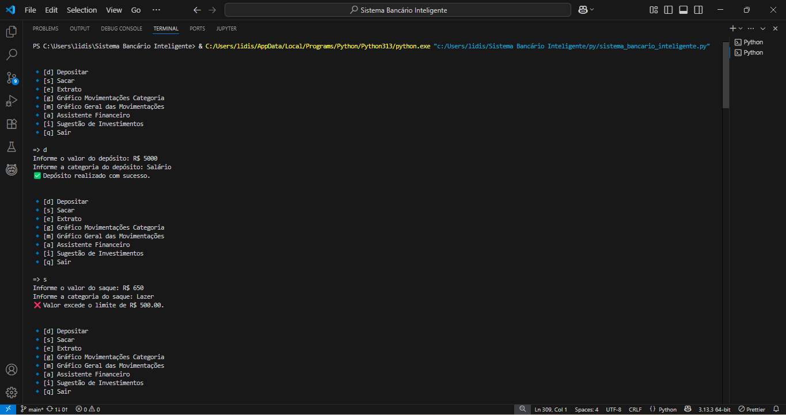</a> <a href="imagens/transacoes_basicas2.png">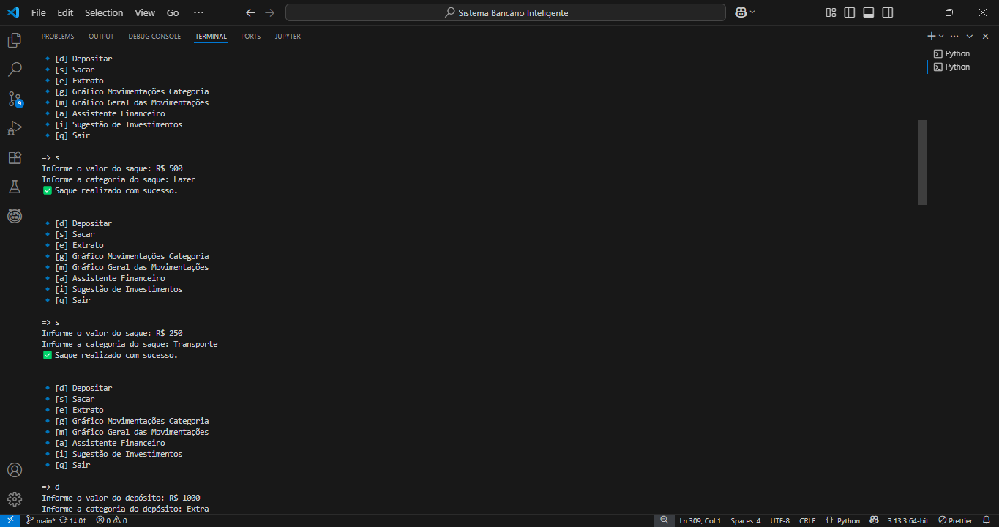</a><br><a href="imagens/transacoes_basicas3.png">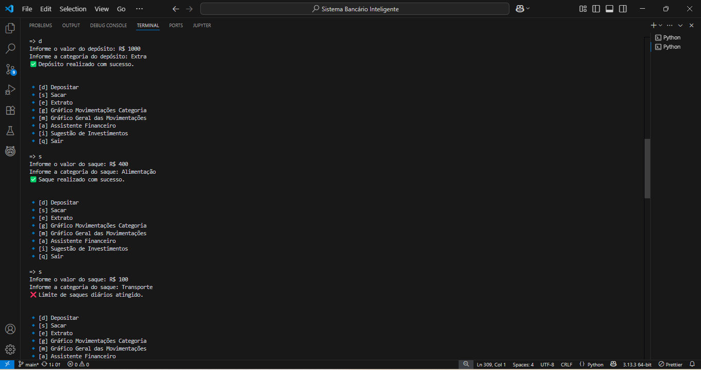</a> <a href="imagens/transacoes_basicas4.png">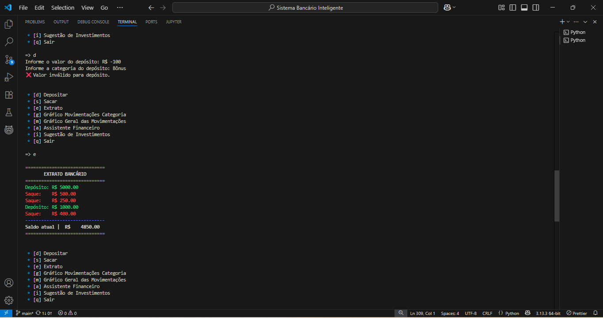</a> |

---

## 📌 Observações
- Sistema simulado para um único usuário.
- Movimentações armazenadas apenas em memória durante a execução.
- Foco educacional: decisões financeiras reais devem ser feitas com auxílio profissional.

---

## 🖼️ Demonstrações visuais

> **Visualização dos Gráficos:** Clique nas imagens para ampliá-las.

| Robô Consultor | Movimentações (Pizza e Barra) | Gráfico por Categorias |
|:--------------:|:-----------------------------:|:-----------------------:|
| <a href="imagens/robozinho_consultor.png"></a> | <a href="imagens/grafico_movimentacoes.png">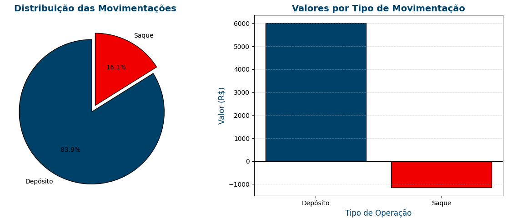</a> | <a href="imagens/grafico_categoria.png">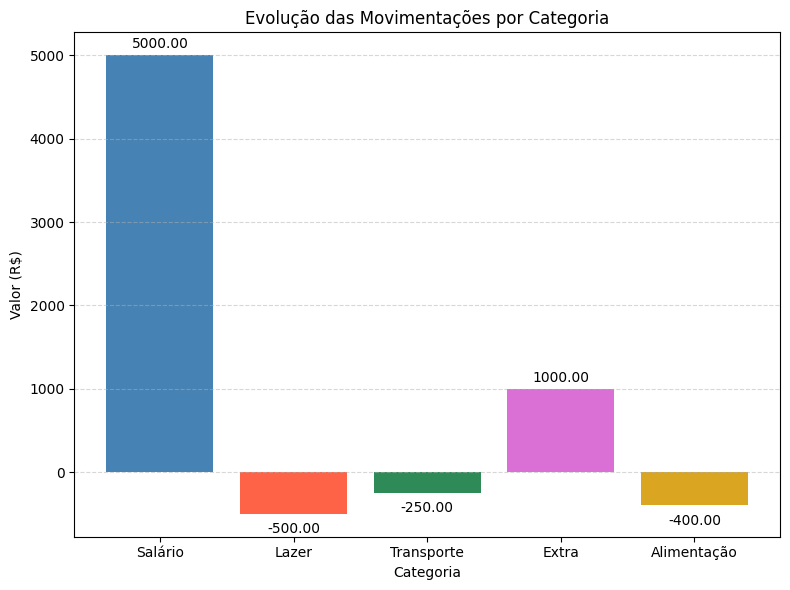</a> |

---

## 🛠️ Tecnologias Utilizadas

- Python 3
- Jupyter Notebook
- Pandas
- NumPy
- Plotly
- ChatGPT — Assistente de IA que auxiliou na estruturação do projeto, dúvidas e sugestões.
- GitHub Copilot — Assistente de codificação que acelerou a implementação das funcionalidades.

---

## ▶️ Como Usar

1. Clone este repositório:

```bash
git clone https://github.com/LidianeSouza/sistema-bancario-inteligente.git
```

2. Navegue até o diretório e abra o notebook:

```bash
cd sistema-bancario-inteligente
jupyter notebook sistema_bancario_inteligente.ipynb
```

3. Execute célula por célula para interagir com o sistema.

---

📂 Estrutura do Projeto

```bash
📁 sistema-bancario-inteligente/
├── 📁 notebook/
│   └── sistema_bancario_inteligente.ipynb        # Notebook principal
├── 📁 imagens/
│   ├── alertas_inteligentes.gif                  # GIF de alertas inteligentes
│   ├── assistente_financeiro.gif                 # GIF do assistente financeiro
│   ├── grafico_categoria.gif                     # GIF de gráfico por categoria
│   ├── grafico_movimentacoes.gif                 # GIF de gráfico de movimentações
│   ├── robozinho_consultor.png                   # Imagem do assistente virtual
│   ├── robozinho_em_acao.gif                     # GIF do Robô Consultor em ação
│   ├── sugestoes_investimentos.gif               # GIF de sugestões de investimentos
│   ├── transacoes_basicas1.png                   # Imagem de transações básicas 1
│   ├── transacoes_basicas2.png                   # Imagem de transações básicas 2
│   ├── transacoes_basicas3.png                   # Imagem de transações básicas 3
│   └── transacoes_basicas4.png                   # Imagem de transações básicas 4
├── 📁 py/
│   ├── alertas_inteligentes.py                   # Script de alertas inteligentes
│   ├── robo_consultor.py                         # Script do Robô Consultor
│   ├── sistema_bancario_inteligente.py           # Script principal do sistema bancário inteligente
│   └── transacoes_bancarias.py                   # Script de transações bancárias
└── README.md                                      # Documentação do projeto
```

---

## 📧 Contato

Desenvolvido por **Lidiane Souza**  
🔗 LinkedIn: [linkedin.com/in/lidiane-souza88](https://linkedin.com/in/lidiane-souza88)
